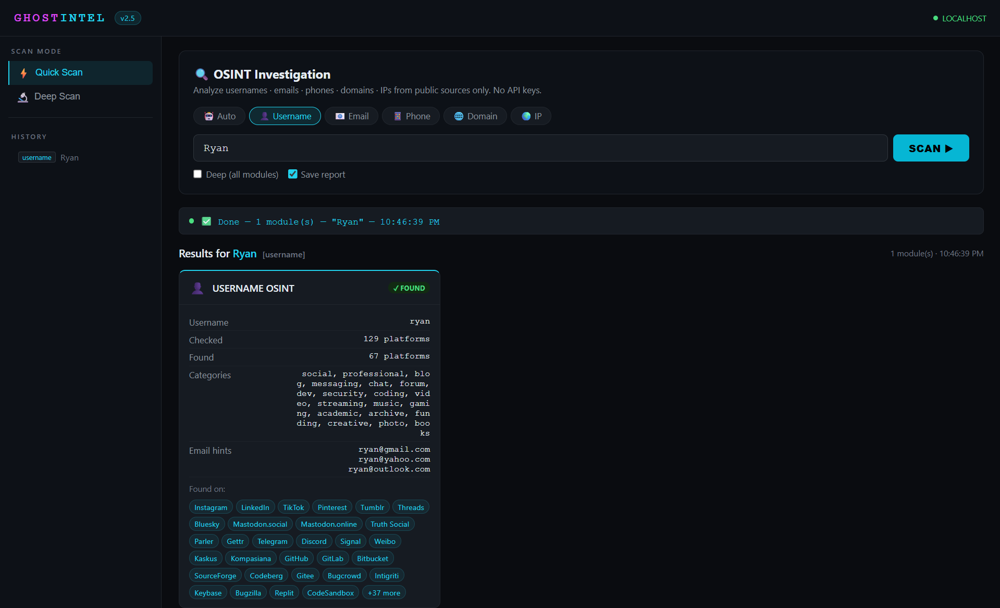
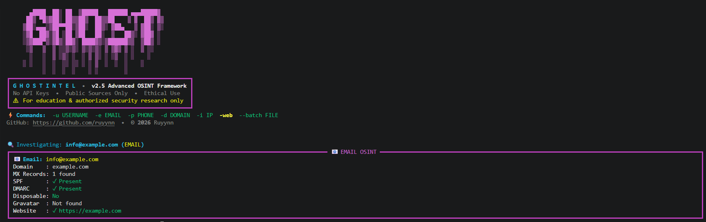
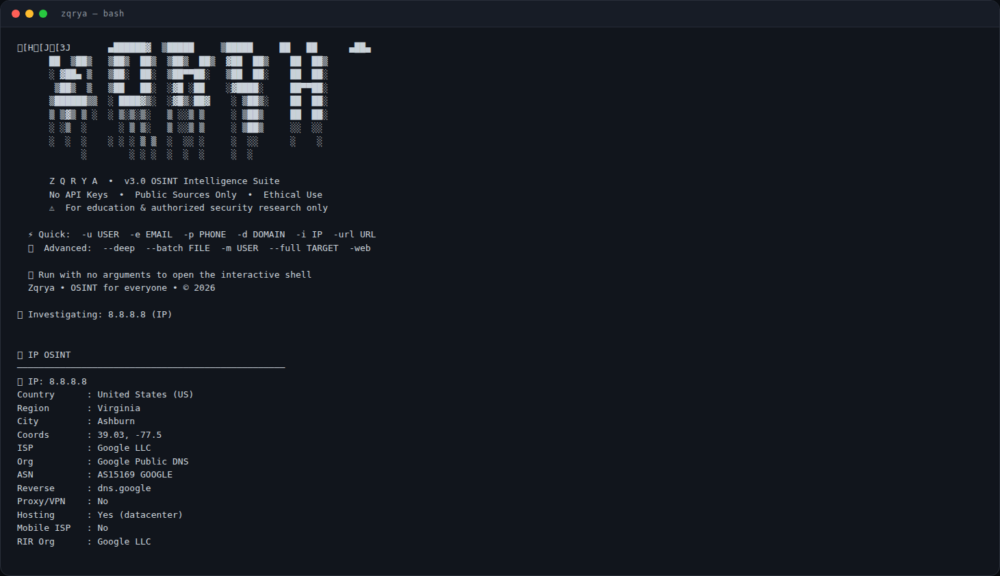
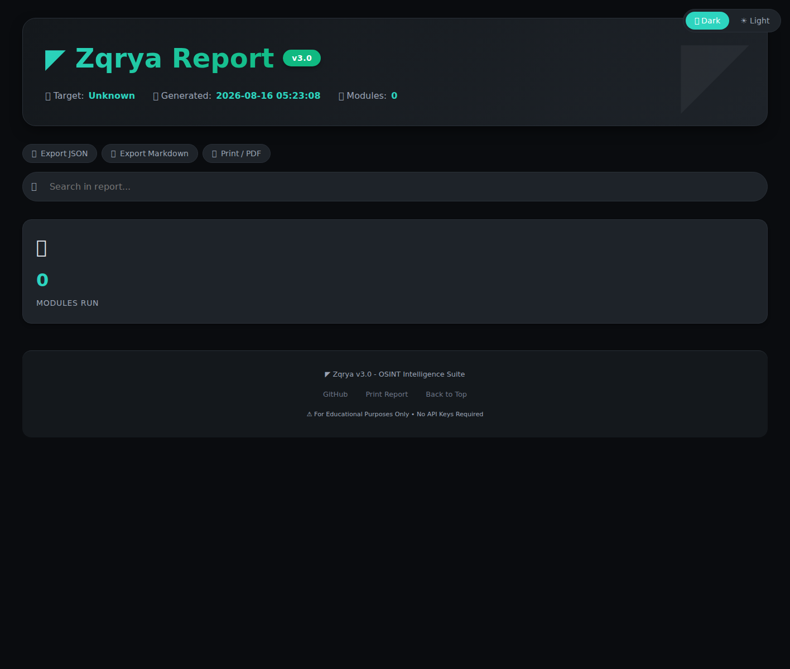

<div align="center">

<!-- Zqrya v3.0 - OSINT Intelligence Suite -->


# 🕵️ Zqrya v3.0

### The Ultimate API-Free OSINT Framework

**Zero API Keys • 100% Public Data • Made in Indonesia 🇮🇩**

[](https://python.org)
[]()
[](LICENSE)
[]()
[]()
[](CONTRIBUTING.md)

> **OSINT Intelligence Suite** — explore, analyze, and gather publicly available information
> about individuals, organizations, and digital assets. **Fast, powerful, and completely API-free.**

</div>

---

## 📑 Table of Contents

<details>
<summary><b>Click to expand</b></summary>

| Section | Description |
|---------|-------------|
| [About Zqrya](#-about-zqrya) | What is this tool? |
| [Screenshots](#-screenshots) | UI previews |
| [Features](#-core-features) | Key capabilities at a glance |
| [Quick Start](#-quick-start) | Installation & first scan |
| [Interactive Shell](#-interactive-shell) | Menu-driven CLI |
| [Web UI](#-web-ui--professional-dashboard) | Localhost dashboard |
| [Deep Pipeline](#-full-intelligence-pipeline) | Maigret + dark web + more |
| [Phone OSINT](#-phone-osint--8-countries) | 8 countries supported |
| [Email Breach](#-email-breach-detection) | Leak alerts + risk score |
| [Username OSINT](#-username-osint--160-platforms) | 160+ platforms |
| [Domain OSINT](#-domain-osint--complete-recon) | DNS + HTTP + WHOIS + tech stack |
| [URL OSINT](#-url-osint--website-footprint) | Website footprint analysis |
| [IP OSINT](#-ip-osint--geolocation--risk-scoring) | Location + threat score |
| [Reports](#-report-formats) | JSON, HTML, TXT, MD |
| [Batch Processing](#-batch-processing) | Multi-target scan |
| [Disclaimer](#-legal-disclaimer) | Read before using |

</details>

---

## 🧠 About Zqrya

_**Zqrya** is a **robust and versatile OSINT (Open Source Intelligence) framework** designed to empower cybersecurity enthusiasts, digital investigators, and ethical hackers. Built with **Python** and completely **API-free**, Zqrya allows users to **explore, analyze, and gather publicly available information** about individuals, organizations, and digital assets quickly and efficiently._

_The framework provides tools to investigate a wide range of data sources, including **usernames, emails, phone numbers, domains, IP addresses, and full website URLs**, making it an all-in-one solution for understanding online footprints, detecting exposure, and performing digital reconnaissance._

---

## 📸 Screenshots

| Domain Result | Username Result | Email Breach |
|:---:|:---:|:---:|
|  |  |  |

| IP Result | Web UI Dashboard | HTML Report |
|:---:|:---:|:---:|
|  |  |  |

---

## ⚡ Core Features

| # | Feature | What It Means |
|---|---------|---------------|
| 1 | **Zero API Keys** | Use immediately — no signup, no payment, no hidden costs |
| 2 | **Async & Fast** | Parallel scanning, 10x faster than similar tools |
| 3 | **Auto Detect** | Paste anything, Zqrya auto-detects the type |
| 4 | **Web UI** | Professional localhost dashboard with dark/light theme |
| 5 | **8 Countries** | Phone OSINT: ID, US, GB, MY, IN, AU, SG, PH |
| 6 | **160+ Platforms** | Username checking across 160+ sites simultaneously |
| 7 | **Maigret 600+** | Deep username search with real names, avatars, bios |
| 8 | **Dark Web Check** | Paste sites + breach DBs (GhostProject, Psbdmp, IntelX...) |
| 9 | **Hudson Rock** | Infostealer infection intelligence (free API) |
| 10 | **URL Footprint** | Extract social links, emails & tech from any website |
| 11 | **WHOIS Lookup** | Domain registration info (registrar, dates) |
| 12 | **Shodan InternetDB** | Open ports, CVEs, tags for any IP |
| 13 | **Username Variants** | Generate 150+ permutations for deeper searches |
| 14 | **Breach Detection** | Email leak alerts + risk score (0-100) |
| 15 | **Batch Processing** | Scan multiple targets from a single file |
| 16 | **4 Report Formats** | JSON, HTML, TXT, Markdown |
| 17 | **Server History** | Web UI saves scan records between sessions |

---

## 🚀 Quick Start

### Installation

```bash
# Clone the repository
git clone https://github.com/webdev11-code/Zqrya-OSINT.git
cd Zqrya-OSINT

# Install dependencies
pip install -r requirements.txt

# Install vendored Maigret engine (600+ platforms)
pip install -e maigret/

# Verify installation
python zqrya.py -h
```

### First Scan Examples

```bash
# Interactive shell (menu-driven)
python zqrya.py

# Username investigation
python zqrya.py -u PiuPiuu

# Email with breach detection
python zqrya.py -e user@gmail.com --report

# Phone number (Indonesia)
python zqrya.py -p 08123456789

# Domain recon with WHOIS & tech detection
python zqrya.py -d example.com --deep

# Website footprint (NEW!)
python zqrya.py -url https://example.com

# Deep username search — Maigret 600+ platforms (NEW!)
python zqrya.py -m PiuPiuu

# Dark web / paste / breach check (NEW!)
python zqrya.py --darkweb user@gmail.com

# Generate 150+ username variants (NEW!)
python zqrya.py --variants PiuPiuu

# Combined OSINT — all Zqrya engines (NEW!)
python zqrya.py --full PiuPiuu

# IP geolocation + risk score
python zqrya.py -i 8.8.8.8

# Launch Web UI (NEW!)
python zqrya.py -web
```

### Configuration

Copy `.env.example` to `.env` to enable optional API keys:

| Variable | Purpose |
|----------|---------|
| `TELEGRAM_BOT_TOKEN` / `TELEGRAM_CHAT_ID` | Send reports to Telegram |
| `EXIFTOOLS_API_KEY` | EXIF metadata extraction |
| `NUMVERIFY_API_KEY` | Phone verification API |
| `VERIPHONE_API_KEY` | City-level phone location (best for ID) |
| `MAIGRET_MAX_SITES` | Max sites for Maigret (default 500 desktop / 100 Termux) |
| `STEALTH_MODE` | Random delays + header rotation |

---

## 🖥️ Interactive Shell

Run `python zqrya.py` (or `python zqrya.py -sh`) with no arguments to launch the
interactive **`Zqrya > `** shell — a complete menu-driven CLI:

```
┌─ MAIN MENU ─────────────────────────────┐
│  [1] 👤  Username OSINT                 │
│  [2] 📧  Email OSINT                    │
│  [3] 📱  Phone OSINT                    │
│  [4] 🌐  Domain Recon                   │
│  [5] 🌍  IP Address                     │
│  [6] 🕸️  Website Footprint (URL)        │
│  [7] 🧠  Maigret Deep Search (600+)     │
│  [8] 🌑  Dark Web / Breach Check        │
│  [9] 🧬  Username Variants              │
│ [10] 🚀  Combined OSINT (Full Scan)     │
│ [11] 📦  Batch Scan                     │
│ [12] 🖥️  Launch Web Dashboard           │
│ [13] 🕘  History                        │
│ [14] ⚙️   Settings                      │
│ [15] ℹ️   About / Help                  │
│ [0]  🚪  Exit                           │
└─────────────────────────────────────────┘
Zqrya > _
```

**In-shell commands:**

| Command | Description |
|---------|-------------|
| `u <name>` / `e <email>` / `p <phone>` | Quick scan shortcuts |
| `d <domain>` / `i <ip>` / `url <url>` | Domain, IP, URL scans |
| `m <name>` / `dw <target>` | Maigret / dark web check |
| `var <name>` / `full <target>` | Variants / combined OSINT scan |
| `batch <file>` | Batch scan from file |
| `deep` | Toggle deep investigation mode |
| `report` | Toggle auto-save report |
| `set-format <fmt>` | json / html / txt / md / all |
| `history` / `again <n>` | View / re-run scan history |
| `web` | Launch web dashboard |
| `help` / `menu` / `clear` / `exit` | Shell utilities |

---

## 🌐 Web UI — Professional Dashboard

> **v3.0 delivers a completely redesigned dashboard.** Clean layout, professional design, dark/light theme.

```bash
python zqrya.py -web
# Open http://localhost:7331 in your browser
```

### Web UI Features

| Feature | Description |
|---------|-------------|
| **Dark/Light Theme** | Toggle themes, preference saved automatically |
| **Server-side History** | Scan records persist to disk, click to re-run |
| **Batch Scan** | Paste multiple targets, scan sequentially |
| **URL Tab** | Website footprint scanning from the dashboard |
| **Deep Scan Modules** | Maigret + dark web + WHOIS — deep scans also run the full deep pipeline (combined) |
| **Live Detection** | Real-time entity type detection as you type |
| **Stats Overview** | Module count, findings, timestamps at a glance |
| **Export Buttons** | JSON / Markdown export directly from browser |
| **Print Support** | Print or save as PDF |
| **Visual Results** | Card-based display with color-coded status |
| **Mobile Friendly** | Responsive design, works on phone/tablet |

---

## 🛰️ Full Intelligence Pipeline

> **Zqrya v3.0 now includes the full intelligence pipeline** — built into the project. This adds a massive OSINT arsenal on top of the core Zqrya modules.
>
> **Combined scan** — `--full` (any target type), `--deep` (username/email/phone), and the shell's deep mode run **both engines in one go**: the Zqrya deep modules **and** the full deep pipeline. Results are merged into a single report (JSON includes both, HTML has a dedicated *Zqrya Module Results* section).

| Capability | Source | What You Get |
|------------|--------|--------------|
| 🧠 **Maigret Engine** | vendored `maigret/` | 600+ platforms, real names, avatars, bios |
| 🌑 **Dark Web Checker** | `dark_web_checker.py` | GhostProject, Psbdmp, BreachDirectory, LeakCheck, IntelX |
| 🦠 **Hudson Rock** | `breach_check.py` | Infostealer infection intelligence (free) |
| 📧 **Email Scanner** | `email_scanner.py` | Registration check on 30+ platforms |
| 📱 **Phone Scanner** | `phone_scanner.py` | Truecaller + 6 social platforms + carrier/geo |
| 🛰️ **Shodan InternetDB** | `ip_tracker.py` | Open ports, CVEs, tags (no API key) |
| 🧬 **Username Variants** | `username_variants.py` | 150+ permutations: leet, separators, suffixes |
| 🔄 **Recursive Search** | `recursive_search.py` | Re-runs searches on discovered usernames |
| 🎭 **Face Search** | `face_search.py` | 5 reverse-image engines on avatars |
| 🕸️ **Social Graph** | `social_graph.py` | Interactive network visualization (pyvis) |

### How to use

```bash
# Deep username search via Maigret (600+ platforms)
python zqrya.py -m PiuPiuu

# Dark web / paste / breach check
python zqrya.py --darkweb user@gmail.com

# Generate 150+ username variants
python zqrya.py --variants PiuPiuu

# COMBINED SCAN — runs the Zqrya engine + full deep pipeline in one go,
# results merged into a single report
python zqrya.py --full PiuPiuu
python zqrya.py --full user@gmail.com
python zqrya.py --full +62812345678

# Deep scan of username/email/phone ALSO runs the deep pipeline (combined)
python zqrya.py -u PiuPiuu --deep
python zqrya.py -e user@gmail.com --deep
python zqrya.py -p 08123456789 --deep
```

---

## 📱 Phone OSINT — 8 Countries

> **The only Indonesian OSINT tool with multi-country phone lookup!**

| Country | Code | Example Command | Providers |
|---------|------|-----------------|-----------|
| 🇮🇩 Indonesia | +62 | `-p 08123456789` | Telkomsel, Indosat, XL, Three, Smartfren |
| 🇺🇸 USA | +1 | `-p +12125551234` | AT&T, Verizon, T-Mobile |
| 🇬🇧 UK | +44 | `-p +447700123456` | EE, O2, Vodafone, Three |
| 🇲🇾 Malaysia | +60 | `-p +60123456789` | Maxis, Celcom, DiGi, U Mobile |
| 🇮🇳 India | +91 | `-p +919876543210` | Airtel, Vi, Jio, BSNL |
| 🇦🇺 Australia | +61 | `-p +61412345678` | Telstra, Optus, Vodafone |
| 🇸🇬 Singapore | +65 | `-p +6581234567` | Singtel, StarHub, M1, SIMBA |
| 🇵🇭 Philippines | +63 | `-p +639171234567` | Globe, Smart, DITO |

**What you get from phone scan:**
- E.164, international, and national formats
- Carrier/provider detection
- Location & timezone information
- WhatsApp + Telegram direct links (if mobile)
- Possible social media handles from the number

---

## 🔐 Email Breach Detection

```bash
python zqrya.py -e user@yahoo.com --report
```

**What you get:**
- **Risk score** (0-100) — higher = more dangerous
- **Breach details** — name, year, records exposed
- **Data types** — what was leaked (emails, passwords, etc.)
- **Security recommendations** — what to do next

**Known breaches in database:**
- Yahoo (3B records), Adobe (152M), LinkedIn (117M)
- Facebook (533M), Twitter (5.4M), Canva (139M)
- Tokopedia (91M), Bhinneka (1.2M), JD.ID (14M)

---

## 👤 Username OSINT — 160+ Platforms

Check usernames across **169+ platforms** simultaneously:

| Category | Platforms |
|----------|-----------|
| **Social** | Facebook, Instagram, Twitter, TikTok, Threads, Bluesky, Snapchat, Pinterest |
| **Developer** | GitHub, GitLab, Bitbucket, HackerOne, Bugcrowd, Keybase, NPM, PyPI, Docker Hub |
| **Gaming** | Steam, Roblox, Xbox, PlayStation, Nintendo, Chess.com, Lichess |
| **Music** | Spotify, SoundCloud, Bandcamp, Genius, Mixcloud, Last.fm |
| **Video** | YouTube, Twitch, Vimeo, Kick, Rumble, Dailymotion, Bilibili, PeerTube |
| **Indonesian** | Kaskus, Kompasiana, Detik Forum, Indowebster, Lintas.me |
| **Professional** | LinkedIn, Upwork, Fiverr, Freelancer, AngelList, Crunchbase, Xing |
| **Blog/Forum** | Medium, Reddit, Quora, Dev.to, HackerNews, ProductHunt, Disqus |

---

## 🌍 Domain OSINT — Complete Recon

```bash
python zqrya.py -d example.com --deep
```

**DNS Records:**
- A, AAAA, NS, MX, TXT, SOA, CNAME, PTR

**WHOIS (NEW in v3.0):**
- Registrar, creation date, expiration date
- Name servers, registration status
- Registrant organization & country

**HTTP Analysis:**
- HTTP/HTTPS status codes
- Server headers, redirect chains
- Response time

**Technology Detection (70+ patterns):**
- **CMS:** WordPress, Joomla, Drupal, Shopify, Wix, Squarespace
- **Frameworks:** React, Vue, Angular, Next.js, Nuxt.js, Svelte
- **Servers:** nginx, Apache, IIS, Cloudflare, LiteSpeed, Caddy
- **E-commerce:** WooCommerce, Magento, BigCommerce, PrestaShop

**Security Headers:**
- HSTS, CSP, X-Frame-Options, X-Content-Type-Options

**SSL/TLS Info:**
- Certificate issuer, expiry date, days left
- DNSSEC status

---

## 🔗 URL OSINT — Website Footprint

> **NEW in v3.0!** Analyze a full website URL to map its digital presence.

```bash
python zqrya.py -url https://example.com
```

**What you get:**
- **Page metadata** — title, description, author, language, OG tags
- **Social profiles** — all social media links found on the page
- **Contact info** — emails & phone numbers extracted from the page
- **Technology stack** — CMS, frameworks, servers, analytics
- **Security headers** — HSTS, CSP, X-Frame-Options
- **Page stats** — total links, external links, response time

---

## 🌍 IP OSINT — Geolocation + Risk Scoring

```bash
python zqrya.py -i 8.8.8.8
```

**Geolocation:**
- Country, region, city, coordinates
- Timezone, ISP, organization
- ASN with name

**Threat Intelligence:**
- **Risk score** (0-100) — based on proxy/VPN/hosting status
- **Proxy/VPN detection** — identifies anonymizers
- **Hosting/datacenter detection**
- **Mobile network detection**

**RDAP Lookup:**
- RIR assignment (ARIN, RIPE, APNIC, LACNIC, AFRINIC)
- Organization registration
- Abuse contact email

---

## 📄 Report Formats

Generate professional reports in **4 formats**:

| Format | Command | Best For |
|--------|---------|----------|
| JSON | `--format json` | Machine parsing, integration with other tools |
| HTML | `--format html` | Interactive visual report with dark/light theme |
| TXT | `--format txt` | Simple, lightweight, readable anywhere |
| Markdown | `--format md` | Documentation, GitHub READMEs |

```bash
# Generate HTML report
python zqrya.py -u PiuPiuu --format html -o report.html

# Generate all formats at once
python zqrya.py -d example.com --format all -o domain_report

# Compressed JSON (saves space)
python zqrya.py -e user@gmail.com --format json --compress
```

---

## 📦 Batch Processing

Scan multiple targets from a single file:

```bash
# Create targets.txt
cat > targets.txt << EOF
PiuPiuu
user@gmail.com
08123456789
example.com
8.8.8.8
EOF

# Run batch scan
python zqrya.py --batch targets.txt --deep --format all
```

**Batch Options:**
- `--batch-delay 2` — Delay between scans (seconds, avoids rate limiting)
- `--output-dir ./reports` — Custom output directory
- `--quiet` — Suppress console output (only save reports)

---

## 🛡️ Legal Disclaimer

**Zqrya is designed for:**
- Education and cybersecurity learning
- Legitimate security research
- Testing on systems you own or have permission to test
- Developing OSINT skills professionally

**Zqrya only uses public sources:**
- Public DNS lookup, RDAP/WHOIS records
- Public websites and legal APIs
- Data already openly available

**Prohibited use (STRICTLY FORBIDDEN):**
- Doxing or exposing personal data without consent
- Stalking, harassment, or intimidation
- Illegal or criminal activities
- Accessing systems or data without authorization

> **By using Zqrya, you take full responsibility for how you use this tool. The author is not responsible for any misuse.**

---

## 🤝 Contributing

Contributions are welcome!

```bash
1. Fork the repository
2. Create a branch: git checkout -b feature/amazing-feature
3. Commit changes: git commit -m 'Add amazing feature'
4. Push: git push origin feature/amazing-feature
5. Open a Pull Request
```

See [CONTRIBUTING.md](CONTRIBUTING.md) for full guide.

---

## 📜 License

MIT License — Feel free to use, modify, and distribute with credit.

---

<div align="center">

### 🕵️ **Zqrya v3.0**

*OSINT Intelligence Suite • 100% Public Data • For Cybersecurity Education*

**© 2026 Zqrya.** Built with ❤️ in Indonesia 🇮🇩

</div>